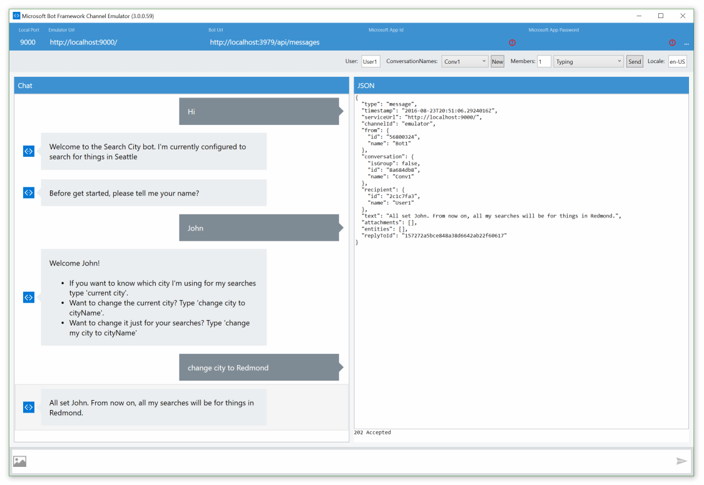
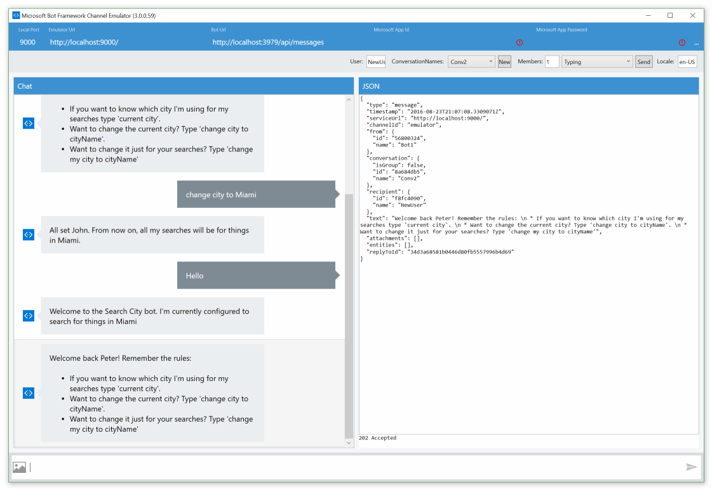

# State API Bot Sample

A stateless sample bot tracking context of a conversation.

[![Deploy to Azure][Deploy Button]][Deploy CSharp/State]
[Deploy Button]: https://azuredeploy.net/deploybutton.png
[Deploy CSharp/State]: https://azuredeploy.net?ptmpl=CSharp/State/azuredeploy.json

### Prerequisites

The minimum prerequisites to run this sample are:
* The latest update of Visual Studio 2015. You can download the community version [here](http://www.visualstudio.com) for free.
* The Bot Framework Emulator. To install the Bot Framework Emulator, download it from [here](https://aka.ms/bf-bc-emulator). Please refer to [this documentation article](https://docs.botframework.com/en-us/csharp/builder/sdkreference/gettingstarted.html#emulator) to know more about the Bot Framework Emulator.

### Code Highlights

The Bot Framework provides several ways of persisting data relative to a user or conversation. Behind the scenes the Bot Framework uses the Bot State Service for tracking context of a conversation. This allows the creation of stateless Bot web services so that they can be scaled.

The `IDialogContext` has several properties which are useful for tracking state.

Property| Use cases
------------ | ------------- 
ConversationData | Remembering context data associated with a conversation.
PrivateConversationData | Remembering context data associated with a user in a conversation.
UserData | Remembering context data associated with a user (across all channels and conversations).

Check out the use of `context.ConversationData` in the [`StartAsync`](StateDialog.cs#L19-L23) method to store a default search city. ConversationData is shared for all users within a conversation.

````C#
public async Task StartAsync(IDialogContext context)
{
    string defaultCity;

    if (!context.ConversationData.TryGetValue(ContextConstants.CityKey, out defaultCity))
    {
        defaultCity = "Seattle";
        context.ConversationData.SetValue(ContextConstants.CityKey, defaultCity);
    }

    await context.PostAsync($"Welcome to the Search City bot. I'm currently configured to search for things in {defaultCity}");
    context.Wait(this.MessageReceivedAsync);
}
````

Also, check out the use of `context.PrivateConversationData` in the [`MessageReceivedAsync`](StateDialog.cs#L52-L63) method where logic is included to override data stored in the `ConversationData` property. PrivateConversationData is private to a specific user within a conversation.

````C#
    string userCity;

    var city = context.ConversationData.Get<string>(ContextConstants.CityKey);

    if (context.PrivateConversationData.TryGetValue(ContextConstants.CityKey, out userCity))
    {
        await context.PostAsync($"{userName}, you have overridden the city. Your searches are for things in  {userCity}. The default conversation city is {city}.");
    }
    else
    {
        await context.PostAsync($"Hey {userName}, I'm currently configured to search for things in {city}.");
    }
````

In contrast, check out the use of `context.UserData` in the [`ResumeAfterPrompt`](StateDialog.cs#L104) method to remember the user's name. UserData is shared across all channels and conversations for this user.

````C#
private async Task ResumeAfterPrompt(IDialogContext context, IAwaitable<string> result)
{
    try
    {
        var userName = await result;
        this.userWelcomed = true;

        await context.PostAsync($"Welcome {userName}! {HelpMessage}");

        context.UserData.SetValue(ContextConstants.UserNameKey, userName);
    }
    catch (TooManyAttemptsException)
    {
    }

    context.Wait(this.MessageReceivedAsync);
}
````

Additionally, Dialog State is automatically persisted with each message to ensure it is properly maintained between each turn of the conversation and it follows the same privacy rules as `PrivateConversationData`. Sub-dialogs have their own private state and does not need to worry about interfering with the parent dialog.
Check out the use of the `userWelcomed` variable in the [`StateDialog`](StateDialog.cs#L104) class to keep track if the welcome message was already sent to the user.

````C#
if (!this.userWelcomed)
{
    this.userWelcomed = true;
    await context.PostAsync($"Welcome back {userName}! Remember the rules: {HelpMessage}");

    context.Wait(this.MessageReceivedAsync);
    return;
}
````

### Outcome

The first time you run this sample it will display a welcome message and configure itself to issue search queries for the 'Seattle' city, storing this value in the ConversationData bag. It will also prompt you for your name and store it in the UserData bag and display a help message. Issuing the `change my city` command will allow you to change the search city for this conversation only and just for your user, storing the value in the PrivateConversationData bag.



Subsequently, you can start a new conversation (In the Bot Framework Channel Emulator this can be done by using the 'ConversationNames - New' button) and this time the bot will remember you name but will forget the city override we executed in the previous conversation. Using the `change city` command this can be changed for all the users in the conversation.


When a another user arrives to the conversation (In the Bot Framework Emulator this is done by editing the 'User' field) the bot will remember its name (Or prompt for the user name depending on any previous conversation) and maintain the previous search city set.




To get more information about how to get started in Bot Builder for .NET and Conversations please review the following resources:
* [Bot Builder for .NET](https://docs.botframework.com/en-us/csharp/builder/sdkreference/index.html)
* [Bot State Service](https://docs.botframework.com/en-us/csharp/builder/sdkreference/stateapi.html)
* [Dialogs - Echo Bot with State](https://docs.botframework.com/en-us/csharp/builder/sdkreference/dialogs.html#echoBot)
* [IDialogContext Interface](https://docs.botframework.com/en-us/csharp/builder/sdkreference/d1/dc6/interface_microsoft_1_1_bot_1_1_builder_1_1_dialogs_1_1_i_dialog_context.html)
